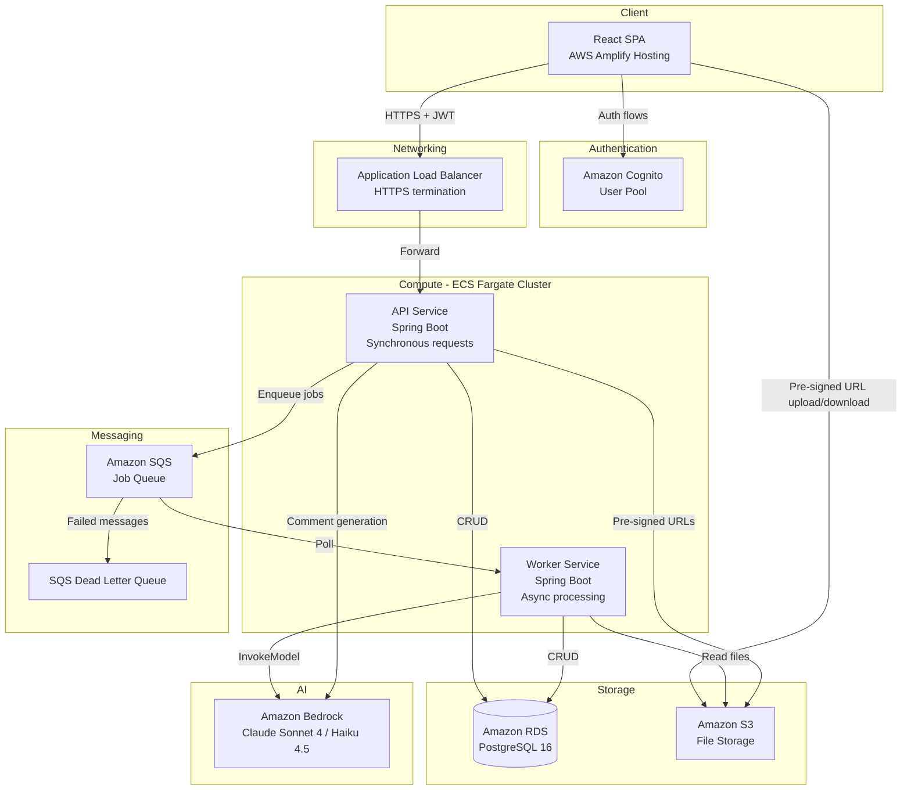
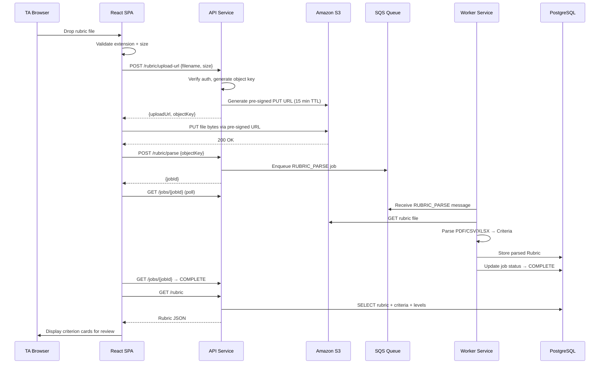
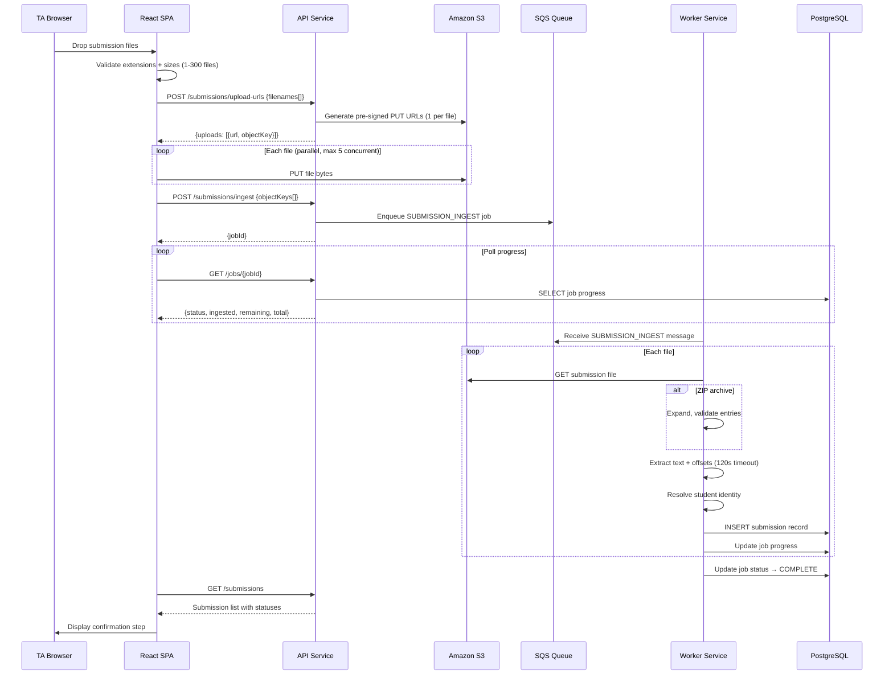
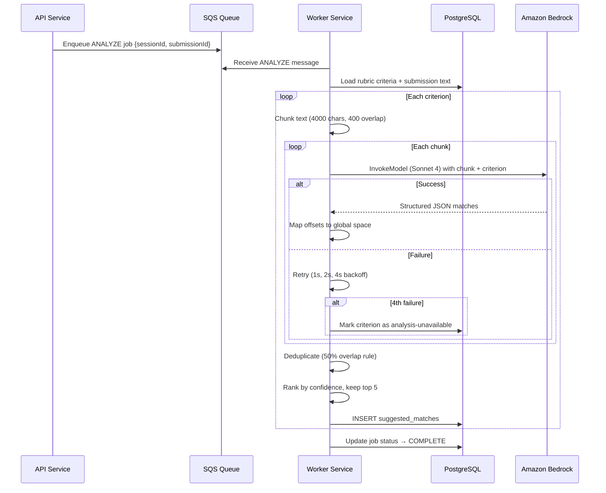
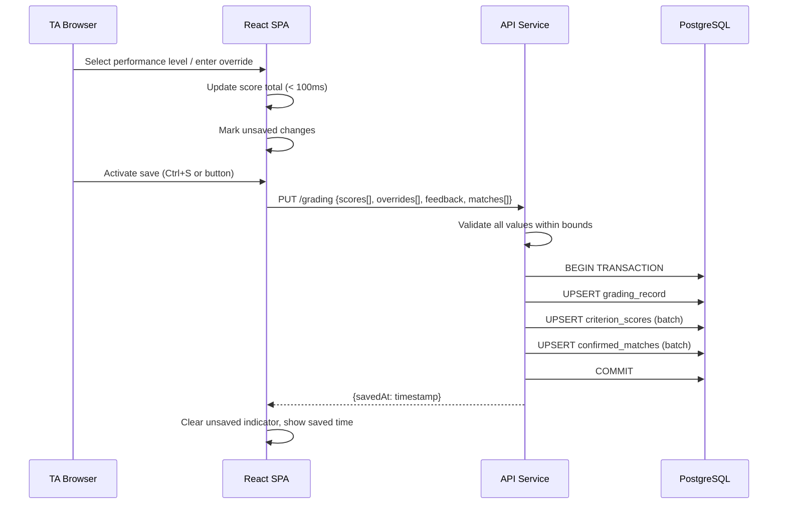
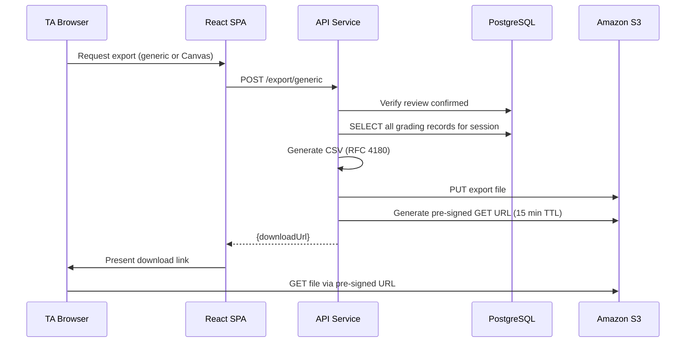

# Design Document: Rubric-Linked Grading Assistant

## Overview

The Rubric-Linked Grading Assistant is a full-stack web application that accelerates TA grading by linking rubric criteria to evidence passages in student submissions. The system is built on AWS with a React SPA frontend deployed via AWS Amplify, a Java Spring Boot backend running on Amazon ECS Fargate, Amazon S3 for file storage, Amazon Bedrock for AI-powered analysis, and Amazon Cognito for authentication.

This design resolves the four deferred decisions from the requirements document and provides implementation-ready specifications for all system components.

### Key Design Decisions

**DD1 — PostgreSQL on Amazon RDS over DynamoDB.** The grading data model requires complex relational queries: joining rubrics to criteria to performance levels, joining submissions to grading records with per-criterion scores, filtering by session/TA ownership, and aggregating totals across criteria for the review screen. These are natural SQL joins and aggregations. DynamoDB would require denormalization into multiple tables with GSIs, duplicating data across access patterns and making the rubric editing flow (which updates criteria that cascade to performance levels) error-prone. The dataset is modest (max 150 submissions × 30 criteria per session, ~10 concurrent TAs) — well within RDS capabilities without the operational complexity of designing DynamoDB single-table schemas. PostgreSQL also provides ACID transactions for the save operation (write grading record + all criterion scores atomically) and native JSON/JSONB columns for semi-structured data like match rationales.

**DD2 — Amazon Bedrock with Claude Sonnet 4 for analysis, Claude Haiku 4.5 for comment generation.** The Match_Engine requires nuanced text comprehension to identify evidence passages and produce rationales — this demands a capable reasoning model (Sonnet). The Comment_Assistant generates feedback snippets from structured inputs (selected levels + confirmed matches) — a simpler task suited to the faster, cheaper Haiku model. Both support structured outputs via JSON schema enforcement on Bedrock, eliminating parsing failures.

**DD3 — Two ECS services: API service (synchronous) and Worker service (async processing).** The API service handles REST requests (save, load, pre-signed URL generation) with sub-second latency. The Worker service polls an SQS queue for long-running jobs (text extraction, batch ingestion, Bedrock analysis). This separation ensures that a 60-second Bedrock analysis call never blocks a 200ms save operation. The API service posts jobs to SQS and the frontend polls a status endpoint.

**DD4 — S3 bucket layout with TA-scoped prefixes.** A single bucket with key prefixes `uploads/{ta_id}/{session_id}/rubrics/`, `uploads/{ta_id}/{session_id}/submissions/`, and `exports/{ta_id}/{session_id}/` provides tenant isolation enforceable by IAM policy conditions. Lifecycle rules apply per prefix pattern.


## Architecture

### High-Level Architecture Diagram




### Request Flow Summary

| Flow | Path | Latency Target |
|------|------|---------------|
| Save grading record | SPA → ALB → API → RDS | < 2s |
| Load submission | SPA → ALB → API → RDS | < 2s |
| Upload file | SPA → ALB → API (pre-signed URL) → SPA → S3 | < 15s |
| Text extraction | API → SQS → Worker → S3 → RDS | < 120s per file |
| AI analysis | API → SQS → Worker → Bedrock → RDS | < 60s per submission |
| Comment suggestions | SPA → ALB → API → Bedrock → SPA | < 15s |
| Export | SPA → ALB → API → RDS → S3 → pre-signed URL | < 30s |

## Components and Interfaces

### Frontend Components (React SPA on AWS Amplify)

The frontend is a production React SPA (separate from the Figma Make prototype in this repo). It uses React 19, TypeScript, Vite, and Tailwind CSS v4.


#### Component Hierarchy

```
App
├── AuthProvider (Cognito integration, token management)
├── SessionListPage (list/resume grading sessions)
├── SessionSetupPage
│   ├── RubricUploadZone (drag-drop, file picker, validation)
│   ├── RubricEditor (manual entry/correction, criterion CRUD)
│   ├── SubmissionUploadZone (batch upload, progress tracking)
│   ├── IngestionReport (extraction results, failures)
│   └── StudentConfirmation (identity review, disambiguation)
├── MarkingView
│   ├── RubricPanel
│   │   ├── CriterionCard (score selection, match counts, states)
│   │   └── PerformanceLevelSelector (keyboard number selection)
│   ├── DocumentViewer
│   │   ├── TextRenderer (paragraph preservation, highlights)
│   │   ├── HighlightLayer (color overlays, overlap handling)
│   │   └── MatchPopover (rationale, confirm/reject controls)
│   ├── FeedbackEditor (per-submission + per-criterion text)
│   ├── CommentAssistant (AI suggestion panel)
│   ├── BatchNavigator (position, progress, submission list)
│   └── KeyboardShortcutOverlay
├── ReviewScreen (grade summary table, flags, export gate)
└── ExportDialog (format selection, download)
```

#### Key Frontend Libraries

| Library | Purpose |
|---------|---------|
| `@aws-amplify/auth` | Cognito sign-in, token refresh, session management |
| `@tanstack/react-query` | Server state management, polling, caching |
| `react-router` | SPA routing between pages |
| `@dnd-kit/core` | Drag-drop for rubric criterion reordering |
| `zustand` | Client-side state (unsaved changes tracking, UI state) |


### Backend Components (Spring Boot on ECS Fargate)

The backend is a Java 21 Spring Boot 3.x application packaged as two ECS services from the same codebase, differentiated by Spring profiles.

#### API Service (profile: `api`)

| Component | Responsibility |
|-----------|---------------|
| `AuthFilter` | Validates Cognito JWT on every request, extracts TA identity |
| `RubricController` | CRUD endpoints for rubrics, triggers parse jobs |
| `SubmissionController` | Upload coordination, pre-signed URL issuance, ingestion status |
| `GradingController` | Save/load grading records, scoring calculations |
| `ReviewController` | Review screen data aggregation, confirmation recording |
| `ExportController` | Triggers export generation, returns download URLs |
| `CommentController` | Synchronous Bedrock call for comment suggestions |
| `UploadService` | Generates scoped pre-signed S3 URLs (PUT for upload, GET for download) |
| `SessionService` | Grading session lifecycle management |

#### Worker Service (profile: `worker`)

| Component | Responsibility |
|-----------|---------------|
| `SqsListener` | Polls SQS queue, routes messages to handlers |
| `RubricParseHandler` | Parses PDF/CSV/XLSX rubric files into structured criteria |
| `SubmissionIngestHandler` | Expands archives, invokes text extraction per file |
| `TextExtractor` | Extracts text + character offsets from PDF/DOCX/TXT/MD |
| `RosterResolver` | Derives student identity from filenames |
| `MatchEngineHandler` | Chunks text, calls Bedrock, produces suggested matches |
| `JobStatusUpdater` | Writes job progress to RDS for API polling |


### API Contract Overview

All endpoints require `Authorization: Bearer <cognito_access_token>` header. All responses use JSON. Tenant isolation is enforced at the service layer — a TA can only access their own resources (404 for others).

#### Session Management

```
POST   /api/sessions                    → Create new grading session
GET    /api/sessions                    → List TA's sessions
GET    /api/sessions/{id}               → Get session details
DELETE /api/sessions/{id}               → Delete session + schedule S3 cleanup
```

#### Rubric

```
POST   /api/sessions/{id}/rubric/upload-url   → Get pre-signed upload URL for rubric file
POST   /api/sessions/{id}/rubric/parse        → Trigger rubric parse (returns job ID)
GET    /api/sessions/{id}/rubric              → Get parsed rubric (criteria + levels)
PUT    /api/sessions/{id}/rubric              → Save edited rubric (full replacement)
POST   /api/sessions/{id}/rubric/export       → Generate rubric CSV export
GET    /api/jobs/{jobId}                      → Poll job status
```

#### Submissions

```
POST   /api/sessions/{id}/submissions/upload-urls  → Get pre-signed URLs for batch (body: filenames[])
POST   /api/sessions/{id}/submissions/ingest       → Trigger ingestion (returns job ID)
GET    /api/sessions/{id}/submissions              → List submissions with status
PUT    /api/sessions/{id}/submissions/{subId}/identity → Update student display name
POST   /api/sessions/{id}/submissions/confirm      → Confirm student identities
```

#### Grading

```
GET    /api/sessions/{id}/submissions/{subId}/grading  → Load grading record + matches
PUT    /api/sessions/{id}/submissions/{subId}/grading  → Save grading record
POST   /api/sessions/{id}/submissions/{subId}/matches/{matchId}/confirm  → Confirm match
POST   /api/sessions/{id}/submissions/{subId}/matches/{matchId}/reject   → Reject match
POST   /api/sessions/{id}/submissions/{subId}/matches/manual             → Create manual match
DELETE /api/sessions/{id}/submissions/{subId}/matches/{matchId}           → Remove confirmed match
POST   /api/sessions/{id}/submissions/{subId}/reanalyze/{criterionId}    → Re-run analysis for criterion
```

#### Comments

```
POST   /api/sessions/{id}/submissions/{subId}/comments/suggest → Get AI comment suggestions
```

#### Review & Export

```
GET    /api/sessions/{id}/review          → Get review screen data (all submissions summary)
POST   /api/sessions/{id}/review/confirm  → Record review confirmation
POST   /api/sessions/{id}/export/generic  → Generate generic CSV export
POST   /api/sessions/{id}/export/canvas   → Generate Canvas CSV export
```


### S3 Bucket Structure and Lifecycle Policies

**Bucket name:** `grading-assistant-files-{account_id}-{region}`

**Key layout:**
```
uploads/
  {ta_id}/
    {session_id}/
      rubrics/
        {uuid}.{ext}              ← Original rubric file
      submissions/
        {uuid}.{ext}              ← Original submission files
        {uuid}.zip                ← Original archives
exports/
  {ta_id}/
    {session_id}/
      rubric-export-{timestamp}.csv
      grades-generic-{timestamp}.csv
      grades-canvas-{timestamp}.csv
```

**Lifecycle rules:**

| Rule | Prefix | Action | Trigger |
|------|--------|--------|---------|
| Export cleanup | `exports/` | Delete | 30 days after creation |
| Upload cleanup | `uploads/` | Delete | 180 days after creation |

The 180-day upload rule is conservative — it covers a full academic term. The Grading_Store (RDS) retains grading records independently of S3 object lifecycle.

**Bucket policy:**
- Block all public access
- Enforce HTTPS-only (`aws:SecureTransport` condition)
- Enforce server-side encryption (AES-256)


### IAM Roles and Trust Relationships

#### ECS Task Execution Role (`grading-ecs-execution-role`)

Trust: `ecs-tasks.amazonaws.com`

Permissions:
- `ecr:GetAuthorizationToken`, `ecr:BatchGetImage` (pull container image)
- `logs:CreateLogStream`, `logs:PutLogEvents` (CloudWatch logging)
- `secretsmanager:GetSecretValue` (RDS credentials, Cognito client secret)

#### API Service Task Role (`grading-api-task-role`)

Trust: `ecs-tasks.amazonaws.com`

Permissions:
- `s3:PutObject`, `s3:GetObject`, `s3:DeleteObject` on `arn:aws:s3:::grading-assistant-files-*/{ta_id_from_request}/*` — scoped at runtime via pre-signed URL generation to the requesting TA's prefix
- `s3:PutObject` on `exports/` prefix
- `sqs:SendMessage` on the job queue
- `rds-db:connect` (IAM authentication to RDS)
- `bedrock:InvokeModel` on `anthropic.claude-haiku-*` (comment generation only)

#### Worker Service Task Role (`grading-worker-task-role`)

Trust: `ecs-tasks.amazonaws.com`

Permissions:
- `s3:GetObject` on `uploads/` prefix (read uploaded files for processing)
- `sqs:ReceiveMessage`, `sqs:DeleteMessage`, `sqs:ChangeMessageVisibility` on the job queue
- `rds-db:connect` (IAM authentication to RDS)
- `bedrock:InvokeModel` on `anthropic.claude-sonnet-*` (match analysis)
- `bedrock:InvokeModel` on `anthropic.claude-haiku-*` (fallback)

#### ALB Security Group

- Inbound: HTTPS (443) from 0.0.0.0/0
- Outbound: to ECS service security group on container port (8080)

#### ECS Service Security Group

- Inbound: from ALB security group on port 8080
- Outbound: to RDS security group on port 5432, to S3 (via VPC endpoint), to Bedrock (via VPC endpoint or NAT), to SQS (via VPC endpoint)

#### RDS Security Group

- Inbound: from ECS service security group on port 5432


### Amazon Bedrock Integration Design

#### Model Selection

| Use Case | Model | Rationale |
|----------|-------|-----------|
| Match_Engine (passage identification + rationale) | Claude Sonnet 4 (`anthropic.claude-sonnet-4-20250514-v1:0`) | Requires nuanced reading comprehension, structured extraction of character offsets, and reasoning about criterion-passage relevance. Sonnet provides the accuracy needed for evidence identification. |
| Comment_Assistant (feedback generation) | Claude Haiku 4.5 (`anthropic.claude-haiku-4-5-20250401-v1:0`) | Generates short feedback snippets from structured inputs. Lower complexity task where speed and cost matter more. 3x cheaper and 3x faster than Sonnet. |

#### Chunking Strategy (Match_Engine)

Per Requirement 6.5, submissions exceeding 4,000 characters are processed in chunks:

1. Split extracted text at 4,000-character boundaries, preferring sentence boundaries within a 200-character window
2. Add 400-character overlap to each chunk (except the first chunk's start and last chunk's end)
3. Each chunk is sent as a separate Bedrock invocation
4. Response offsets are mapped back to the global offset space by adding the chunk's start position minus any overlap adjustment

#### Prompt Structure (Match_Engine)

```
System: You are a rubric-matching assistant. Given a rubric criterion and a text 
chunk from a student submission, identify passages that provide evidence for or 
against meeting this criterion. Return structured JSON.

User:
## Criterion
Title: {criterion.title}
Description: {criterion.description}
Performance Levels: {JSON array of level labels + descriptions}

## Text Chunk
Start offset: {chunk_start_offset}
Text: {chunk_text}

## Instructions
Identify up to 5 passages (20-1500 characters each) that provide evidence for 
this criterion. For each passage, return:
- start_offset: character offset relative to chunk start + {chunk_start_offset}
- end_offset: character offset relative to chunk start + {chunk_start_offset}
- rationale: 1-300 character explanation of why this passage is relevant
- confidence: 0.00-1.00 assessment of match strength

Return empty matches array if no relevant passages exist.
```

#### Structured Output Schema (Match_Engine)

Bedrock's structured outputs feature enforces the response conforms to:

```json
{
  "type": "object",
  "properties": {
    "matches": {
      "type": "array",
      "items": {
        "type": "object",
        "properties": {
          "start_offset": { "type": "integer", "minimum": 0 },
          "end_offset": { "type": "integer", "minimum": 1 },
          "rationale": { "type": "string", "minLength": 1, "maxLength": 300 },
          "confidence": { "type": "number", "minimum": 0.0, "maximum": 1.0 }
        },
        "required": ["start_offset", "end_offset", "rationale", "confidence"]
      },
      "maxItems": 5
    }
  },
  "required": ["matches"]
}
```

#### Prompt Structure (Comment_Assistant)

```
System: You are a constructive feedback writing assistant for academic grading. 
Generate specific, actionable feedback based on the rubric levels selected and 
evidence found.

User:
## Rubric Criteria and Selected Levels
{JSON array: criterion title, selected level label, level description, awarded points}

## Confirmed Evidence
{JSON array: criterion title, passage text, rationale}

## Instructions
Generate 1-5 feedback snippets (each 1-1000 characters) that:
- Reference specific strengths and areas for improvement
- Are constructive and actionable
- Match the tone of academic feedback
```

#### Retry and Error Handling

- Timeout: 30 seconds per Bedrock invocation
- Retry: exponential backoff (1s, 2s, 4s) up to 3 retries
- After 4th failure: mark criterion/submission pair as `analysis-unavailable`
- Throttling: respect Bedrock's rate limits via a semaphore (max 5 concurrent invocations per worker instance)


### Sequence Diagrams

#### Upload and Rubric Parse Flow



#### Submission Ingestion Flow




#### AI Analysis Flow (Match_Engine)



#### Grading and Save Flow



#### Export Flow




## Data Models

### PostgreSQL Schema

```sql
-- Core identity
CREATE TABLE ta_user (
    id              UUID PRIMARY KEY DEFAULT gen_random_uuid(),
    cognito_sub     VARCHAR(128) NOT NULL UNIQUE,
    email           VARCHAR(320) NOT NULL,
    created_at      TIMESTAMPTZ NOT NULL DEFAULT now()
);

-- Grading session
CREATE TABLE grading_session (
    id              UUID PRIMARY KEY DEFAULT gen_random_uuid(),
    ta_id           UUID NOT NULL REFERENCES ta_user(id),
    name            VARCHAR(200) NOT NULL,
    review_confirmed_at TIMESTAMPTZ,
    created_at      TIMESTAMPTZ NOT NULL DEFAULT now(),
    updated_at      TIMESTAMPTZ NOT NULL DEFAULT now()
);
CREATE INDEX idx_session_ta ON grading_session(ta_id);

-- Rubric
CREATE TABLE rubric (
    id              UUID PRIMARY KEY DEFAULT gen_random_uuid(),
    session_id      UUID NOT NULL UNIQUE REFERENCES grading_session(id) ON DELETE CASCADE,
    s3_key          VARCHAR(512),
    source_format   VARCHAR(10), -- 'pdf', 'csv', 'xlsx', 'manual'
    created_at      TIMESTAMPTZ NOT NULL DEFAULT now(),
    updated_at      TIMESTAMPTZ NOT NULL DEFAULT now()
);

-- Criterion
CREATE TABLE criterion (
    id              UUID PRIMARY KEY DEFAULT gen_random_uuid(),
    rubric_id       UUID NOT NULL REFERENCES rubric(id) ON DELETE CASCADE,
    title           VARCHAR(200) NOT NULL,
    description     VARCHAR(2000) NOT NULL DEFAULT '',
    max_points      DECIMAL(7,2),  -- NULL = unresolved
    display_color   VARCHAR(7) NOT NULL,  -- hex color #RRGGBB
    position        SMALLINT NOT NULL,
    requires_completion BOOLEAN NOT NULL DEFAULT false,
    created_at      TIMESTAMPTZ NOT NULL DEFAULT now()
);
CREATE INDEX idx_criterion_rubric ON criterion(rubric_id, position);

-- Performance level
CREATE TABLE performance_level (
    id              UUID PRIMARY KEY DEFAULT gen_random_uuid(),
    criterion_id    UUID NOT NULL REFERENCES criterion(id) ON DELETE CASCADE,
    label           VARCHAR(100) NOT NULL,
    description     VARCHAR(2000) NOT NULL DEFAULT '',
    points          DECIMAL(7,2),  -- NULL = unresolved
    position        SMALLINT NOT NULL
);
CREATE INDEX idx_level_criterion ON performance_level(criterion_id, position);

-- Submission
CREATE TABLE submission (
    id              UUID PRIMARY KEY DEFAULT gen_random_uuid(),
    session_id      UUID NOT NULL REFERENCES grading_session(id) ON DELETE CASCADE,
    s3_key          VARCHAR(512) NOT NULL,
    original_filename VARCHAR(512) NOT NULL,
    student_display_name VARCHAR(200) NOT NULL,
    canvas_submission_id VARCHAR(100),
    identity_status VARCHAR(20) NOT NULL DEFAULT 'unverified',
        -- 'verified', 'unverified', 'disambiguation_required'
    extraction_status VARCHAR(20) NOT NULL DEFAULT 'pending',
        -- 'pending', 'success', 'failed'
    extraction_failure_reason VARCHAR(50),
        -- 'unreadable_file', 'password_protected', 'no_extractable_text', 'extraction_timeout'
    extracted_text  TEXT,
    extracted_char_count INTEGER,
    is_oversized    BOOLEAN NOT NULL DEFAULT false,
    position        INTEGER NOT NULL,
    created_at      TIMESTAMPTZ NOT NULL DEFAULT now()
);
CREATE INDEX idx_submission_session ON submission(session_id, position);

-- Suggested match (AI-generated)
CREATE TABLE suggested_match (
    id              UUID PRIMARY KEY DEFAULT gen_random_uuid(),
    submission_id   UUID NOT NULL REFERENCES submission(id) ON DELETE CASCADE,
    criterion_id    UUID NOT NULL REFERENCES criterion(id) ON DELETE CASCADE,
    passage_start   INTEGER NOT NULL,
    passage_end     INTEGER NOT NULL,
    rationale       VARCHAR(300) NOT NULL,
    confidence      DECIMAL(3,2) NOT NULL,
    match_state     VARCHAR(20) NOT NULL DEFAULT 'suggested',
        -- 'suggested', 'confirmed', 'rejected'
    is_stale        BOOLEAN NOT NULL DEFAULT false,
    discard_reason  VARCHAR(200),
    created_at      TIMESTAMPTZ NOT NULL DEFAULT now()
);
CREATE INDEX idx_match_submission_criterion 
    ON suggested_match(submission_id, criterion_id);

-- Confirmed match (TA-authored or confirmed from suggestion)
CREATE TABLE confirmed_match (
    id              UUID PRIMARY KEY DEFAULT gen_random_uuid(),
    submission_id   UUID NOT NULL REFERENCES submission(id) ON DELETE CASCADE,
    criterion_id    UUID NOT NULL REFERENCES criterion(id) ON DELETE CASCADE,
    passage_start   INTEGER NOT NULL,
    passage_end     INTEGER NOT NULL,
    rationale       VARCHAR(300) NOT NULL,
    confidence      DECIMAL(3,2),  -- NULL for TA-authored
    origin          VARCHAR(20) NOT NULL,
        -- 'ta_confirmed', 'ta_authored'
    source_match_id UUID REFERENCES suggested_match(id),
    created_at      TIMESTAMPTZ NOT NULL DEFAULT now()
);
CREATE INDEX idx_confirmed_submission_criterion 
    ON confirmed_match(submission_id, criterion_id);

-- Grading record (per submission)
CREATE TABLE grading_record (
    id              UUID PRIMARY KEY DEFAULT gen_random_uuid(),
    submission_id   UUID NOT NULL UNIQUE REFERENCES submission(id) ON DELETE CASCADE,
    overall_feedback TEXT NOT NULL DEFAULT '',
    saved_at        TIMESTAMPTZ,
    created_at      TIMESTAMPTZ NOT NULL DEFAULT now()
);

-- Per-criterion score
CREATE TABLE criterion_score (
    id                  UUID PRIMARY KEY DEFAULT gen_random_uuid(),
    grading_record_id   UUID NOT NULL REFERENCES grading_record(id) ON DELETE CASCADE,
    criterion_id        UUID NOT NULL REFERENCES criterion(id) ON DELETE CASCADE,
    selected_level_id   UUID REFERENCES performance_level(id),
    override_points     DECIMAL(7,2),
    criterion_feedback  VARCHAR(2000) NOT NULL DEFAULT '',
    UNIQUE(grading_record_id, criterion_id)
);
CREATE INDEX idx_score_record ON criterion_score(grading_record_id);

-- Async job tracking
CREATE TABLE async_job (
    id              UUID PRIMARY KEY DEFAULT gen_random_uuid(),
    session_id      UUID NOT NULL REFERENCES grading_session(id) ON DELETE CASCADE,
    job_type        VARCHAR(30) NOT NULL,
        -- 'rubric_parse', 'submission_ingest', 'match_analysis'
    status          VARCHAR(20) NOT NULL DEFAULT 'pending',
        -- 'pending', 'in_progress', 'complete', 'failed'
    progress_current INTEGER NOT NULL DEFAULT 0,
    progress_total  INTEGER NOT NULL DEFAULT 0,
    failure_reason  VARCHAR(500),
    created_at      TIMESTAMPTZ NOT NULL DEFAULT now(),
    updated_at      TIMESTAMPTZ NOT NULL DEFAULT now()
);
CREATE INDEX idx_job_session ON async_job(session_id, status);
```


### Access Pattern Justification (DD1)

| Requirement | Access Pattern | Why PostgreSQL Fits |
|-------------|---------------|-------------------|
| Req 7.2-4 (Rubric Panel) | Load rubric → criteria → levels in order | Single JOIN query with ORDER BY position |
| Req 11.3,9 (Score Calculator) | Sum awarded points across criteria for one submission | SUM() aggregate with GROUP BY |
| Req 14.2 (Save) | Atomically write grading record + all criterion scores | Single TRANSACTION with batch UPSERT |
| Req 15.2 (Review Screen) | Load all submissions with per-criterion scores, totals | JOIN submissions → grading_records → criterion_scores with aggregation |
| Req 2.1-4 (Rubric Editor) | Update individual criterion fields, reorder positions | UPDATE with WHERE clause, no denormalization needed |
| Req 6.11 (Match reuse) | Load existing matches for submission+rubric pair | Indexed query on (submission_id, criterion_id) |
| Req 19.9 (Concurrency) | 10 TAs × 150 submissions concurrently | RDS db.t4g.medium handles this load easily; connection pooling via HikariCP |

DynamoDB would require:
- A single-table design with complex GSIs for the review screen aggregation
- Scatter-gather reads for the review screen (read 150 items × 30 criteria = 4,500 reads)
- Transaction limitations (max 100 items per TransactWriteItems) blocking atomic saves of large rubrics
- Duplicated criterion data in every grading record for denormalized access

PostgreSQL wins on query flexibility, transactional safety, and simplicity for this moderate-scale workload.


### Security Design (Authentication and Tenant Isolation)

#### Cognito Integration

- **User Pool**: Single user pool with email+password authentication
- **Account creation**: Admin-only (Cognito admin API, no self-signup)
- **Token type**: Access token (JWT) sent as Bearer token
- **Token validation**: API Service validates JWT signature using Cognito JWKS endpoint, checks `exp`, `iss`, `token_use=access`
- **Token refresh**: Frontend uses `@aws-amplify/auth` to transparently refresh tokens before expiry
- **Re-authentication**: When a 401 is received while Marking_View is open, SPA shows re-auth modal without discarding unsaved state

#### Tenant Isolation Enforcement

```java
// AuthFilter extracts TA identity on every request
@Component
public class AuthFilter extends OncePerRequestFilter {
    @Override
    protected void doFilterInternal(request, response, chain) {
        String token = extractBearerToken(request);
        DecodedJWT jwt = cognitoVerifier.verify(token); // throws on invalid
        String cognitoSub = jwt.getSubject();
        TaUser ta = taUserRepository.findByCognitoSub(cognitoSub);
        SecurityContextHolder.getContext().setAuthentication(
            new TaAuthentication(ta.getId())
        );
        chain.doFilter(request, response);
    }
}

// Every repository query includes ta_id filter
@Query("SELECT s FROM GradingSession s WHERE s.id = :id AND s.taId = :taId")
Optional<GradingSession> findByIdAndTaId(UUID id, UUID taId);
```

- Every data access query includes the authenticated TA's ID as a WHERE clause
- Accessing another TA's resource returns 404 (not 403, to avoid information leakage)
- Pre-signed URLs are scoped to the TA's S3 prefix: `uploads/{ta_id}/...`

#### Logging Constraints (Requirement 18.11)

The API and Worker services use structured JSON logging (Logback + logstash-encoder). A custom `SensitiveDataFilter` strips:
- Access tokens from all log fields
- Student display names
- Feedback text content

Only IDs (session_id, submission_id, criterion_id) appear in logs.


### Scalability and Resilience Patterns

#### ECS Service Design

| Service | Min Tasks | Max Tasks | Scaling Metric | Target |
|---------|-----------|-----------|----------------|--------|
| API Service | 2 | 8 | CPU utilization | 60% |
| Worker Service | 1 | 4 | SQS ApproximateNumberOfMessagesVisible | 10 messages |

**API Service:**
- Health check: ALB → `/actuator/health` every 30s
- Graceful shutdown: 30s drain period on SIGTERM
- Connection pool: HikariCP, max 20 connections per task (RDS max_connections = 200 for db.t4g.medium)

**Worker Service:**
- Long-polling SQS: 20s wait time
- Visibility timeout: 300s (covers longest operation: batch ingestion of 150 files)
- Dead letter queue: max 3 receives before moving to DLQ
- Graceful shutdown: finish current message, then stop polling

#### Async Job Resumability (Requirement 19.7)

The Worker tracks ingestion progress at the per-file level:

1. Each file gets a row in a `submission_ingest_item` tracking table (status: pending/processing/done/failed)
2. When a worker picks up an INGEST job, it queries for items with status = `pending`
3. If the task terminates mid-batch, the SQS message becomes visible again after visibility timeout
4. The next worker picks up the same job, finds already-processed items (status = `done`), and continues with remaining items
5. Idempotency key: `(session_id, original_filename)` prevents duplicate submission records

#### SQS Queue Configuration

```
Queue: grading-job-queue
  VisibilityTimeout: 300 seconds
  MessageRetentionPeriod: 4 days
  ReceiveMessageWaitTimeSeconds: 20

DLQ: grading-job-dlq
  MessageRetentionPeriod: 14 days
  maxReceiveCount: 3
```

#### RDS Configuration

- Engine: PostgreSQL 16
- Instance: db.t4g.medium (2 vCPU, 4 GB RAM) — sufficient for 10 concurrent TAs
- Storage: 50 GB gp3, auto-scaling to 200 GB
- Multi-AZ: enabled for production resilience
- Automated backups: 7-day retention
- IAM DB authentication: enabled (no long-lived passwords in config)


## Correctness Properties

*A property is a characteristic or behavior that should hold true across all valid executions of a system — essentially, a formal statement about what the system should do. Properties serve as the bridge between human-readable specifications and machine-verifiable correctness guarantees.*

### Property 1: Rubric Serialization Round-Trip

*For any* valid Rubric containing 1-30 criteria each with 1-10 performance levels (including criteria with special characters in titles, descriptions, and level labels — commas, double quotes, line breaks, leading/trailing whitespace), serializing via the Rubric_Printer and then parsing via the Rubric_Parser SHALL produce a Rubric whose criterion count, criterion order, titles, descriptions, maximum point values, display colors, performance level counts, level order, level labels, level descriptions, and level point values are equal field by field to the original, with text values equal character for character, numeric values equal exactly, and unresolved values preserved as unresolved.

**Validates: Requirements 3.3, 3.5**

### Property 2: Rubric Parse Idempotence

*For any* valid CSV rubric file content that the Rubric_Parser accepts, applying Rubric_Parser → Rubric_Printer → Rubric_Parser SHALL produce a Rubric equal field by field to the result of the first Rubric_Parser application.

**Validates: Requirements 3.4**

### Property 3: Text Run Ordering Invariant

*For any* submission file processed by the Text_Extractor, the resulting text runs SHALL each have a start offset strictly less than its end offset, SHALL appear in ascending start offset order, and no two runs SHALL overlap (each run's start offset is greater than or equal to the previous run's end offset).

**Validates: Requirements 4.5**

### Property 4: Student Identity Normalization

*For any* submission filename string, the Roster_Resolver SHALL produce a student display name that has no leading whitespace, no trailing whitespace, no consecutive whitespace characters, and a length between 1 and 200 characters inclusive. Additionally, *for any* filename matching the Canvas convention pattern, the Roster_Resolver SHALL extract the student name segment and mark the identity as verified.

**Validates: Requirements 5.1, 5.2**

### Property 5: Match Output Field Invariant

*For any* Suggested_Match produced by the Match_Engine for a submission with analyzed character length L, the match SHALL have a passage start offset and end offset satisfying 0 <= start < end <= L, with (end - start) between 20 and 1500 inclusive, a rationale of 1-300 characters, and a confidence between 0.00 and 1.00 inclusive.

**Validates: Requirements 6.2, 6.3**

### Property 6: Match Overlap Deduplication

*For any* set of Suggested_Match records retained by the Match_Engine for a single (criterion, submission) pair, no two retained matches SHALL have passage ranges that overlap by 50 percent or more of the shorter of the two ranges.

**Validates: Requirements 6.4**

### Property 7: Chunk Offset Remapping Correctness

*For any* submission text of length > 4000 characters, when chunked into 4000-character segments with 400-character overlap, and *for any* passage offset pair (start, end) returned by Bedrock within a chunk, the remapped global offsets SHALL index into the original submission text to yield the same substring as the local offsets index into the chunk text.

**Validates: Requirements 6.5**

### Property 8: Score Total Arithmetic

*For any* grading record with a set of criterion scores (each being either a selected performance level's fixed point value or a manual override between 0 and the criterion's maximum), the displayed total score SHALL equal the sum of all awarded points rounded to 2 decimal places, and the maximum score SHALL equal the sum of all criterion maximum point values rounded to 2 decimal places.

**Validates: Requirements 11.3, 11.9**

### Property 9: Grading Record Persistence Round-Trip

*For any* complete grading record (containing performance level selections, point overrides, feedback text, and confirmed matches), saving the record to the Grading_Store and then loading it back SHALL yield a record equal field by field to the saved record, with text values equal character for character and numeric values equal exactly.

**Validates: Requirements 14.10**

### Property 10: Export CSV Round-Trip

*For any* grading session data containing student display names, per-criterion awarded points, selected performance level labels, total scores, and feedback text (including values with commas, double quotes, line breaks, and leading/trailing whitespace), the generic export CSV file when parsed as RFC 4180 SHALL yield values equal to those held in the Grading_Store, with text values equal character for character and numeric values equal exactly.

**Validates: Requirements 16.6, 16.7**


## Error Handling

### Error Categories and Response Strategy

| Category | HTTP Status | Client Behavior | Example |
|----------|-------------|-----------------|---------|
| Validation error | 400 | Display field-specific message, retain input | Invalid point value, empty title |
| Authentication failure | 401 | Show re-auth modal, retain unsaved state | Expired token |
| Not found (or forbidden) | 404 | Display "resource not found" | Accessing another TA's session |
| Conflict | 409 | Display conflict details, offer retry | Concurrent save race |
| Processing failure | 422 | Display reason, offer retry or manual fallback | Rubric parse failure, extraction failure |
| Timeout | 504 | Display timeout message, offer retry | Bedrock 30s timeout, save 30s timeout |
| Server error | 500 | Display generic error, offer retry | Unexpected exception |

### Retry Patterns

| Operation | Retry Strategy | Max Attempts | Backoff |
|-----------|---------------|--------------|---------|
| Bedrock invocation | Exponential | 4 (1 + 3 retries) | 1s, 2s, 4s |
| S3 pre-signed URL upload | Client retry | 2 | 0s (immediate) |
| Save grading record | No auto-retry | 1 | Manual retry button |
| SQS message delivery | SQS native | 3 | Visibility timeout (300s) |

### Failure Isolation

- A single submission extraction failure does not halt batch ingestion (Req 4.7)
- A single criterion analysis failure does not block other criteria (Req 6.7-8)
- A failed Bedrock call for comment suggestions shows error but preserves all entered feedback (Req 12.6)
- A failed save retains all edits in the browser and shows a retry button (Req 14.6)
- A worker task crash triggers SQS re-delivery to a healthy worker (Req 19.7)

### Structured Error Response Format

```json
{
  "error": {
    "code": "RUBRIC_PARSE_FAILED",
    "message": "Could not identify any criteria in file rubric.pdf",
    "details": {
      "filename": "rubric.pdf",
      "attempted_format": "pdf",
      "reason": "No table structure detected in extracted text"
    }
  }
}
```


## Testing Strategy

### Dual Testing Approach

This system combines property-based tests for core logic correctness with example-based tests for integration points, UI behavior, and edge cases.

### Property-Based Tests (JUnit 5 + jqwik)

The backend uses [jqwik](https://jqwik.net/) as the property-based testing library for Java. Each property test runs a minimum of 100 iterations with randomized inputs.

| Property | Component Under Test | Generator Strategy |
|----------|---------------------|-------------------|
| 1: Rubric round-trip | RubricPrinter + RubricParser | Generate Rubric objects with 1-30 criteria, 1-10 levels, special chars in all text fields |
| 2: Parse idempotence | RubricParser + RubricPrinter | Generate valid CSV content strings |
| 3: Text run ordering | TextExtractor | Generate text content, verify output invariant |
| 4: Identity normalization | RosterResolver | Generate filenames with whitespace, long names, Canvas-format names |
| 5: Match field invariant | MatchEngine (with mocked Bedrock) | Generate submission texts + Bedrock responses, verify bounds |
| 6: Overlap deduplication | MatchDeduplicator | Generate candidate match sets with varying overlap percentages |
| 7: Chunk offset remapping | ChunkMapper | Generate texts > 4000 chars, generate in-chunk offsets, verify remapping |
| 8: Score arithmetic | ScoreCalculator | Generate criterion score sets with decimals, overrides, partial scoring |
| 9: Grading persistence | GradingRepository (integration) | Generate full grading records, save + load via testcontainers PostgreSQL |
| 10: Export round-trip | ExportService + CSV parser | Generate grading sessions with special characters in all fields |

Each test is tagged with:
```java
// Feature: rubric-linked-grading-assistant, Property 1: Rubric Serialization Round-Trip
@Property(tries = 100)
@Tag("pbt")
void rubricRoundTrip(@ForAll("validRubrics") Rubric rubric) { ... }
```

### Unit Tests (JUnit 5 + Mockito)

| Area | Tests |
|------|-------|
| AuthFilter | Expired token → 401, missing token → 401, valid token → passes |
| Tenant isolation | TA-A accessing TA-B's session → 404 |
| Validation | Invalid point values, empty titles, oversized fields → 400 |
| Rubric_Editor rules | Level points > max → rejection, invalid max format → rejection |
| Score_Calculator edge cases | All criteria unscored, single override removal, level change replacing override |
| Comment_Assistant | Zero selections → blocked, timeout → failure with retained text |
| Export_Service | Empty session → blocked, Canvas format header matches spec |

### Integration Tests (Spring Boot Test + Testcontainers)

| Area | Tests |
|------|-------|
| Full upload flow | Pre-signed URL → S3 upload → parse trigger → job completion |
| Submission ingestion | ZIP with valid/invalid entries → correct submission records |
| Bedrock integration | Real model invocation with test criterion + submission (optional, CI-skip) |
| Auth flow | Cognito token → API access → data isolation |
| Export | Full session → CSV download → parsed content matches |

### Frontend Tests (Vitest + React Testing Library)

| Area | Tests |
|------|-------|
| ScoreCalculator component | Renders correct total, updates within 100ms |
| HighlightLayer | Correct color overlay, overlap handling for 2-4 and 5+ ranges |
| Keyboard shortcuts | All shortcuts trigger correct actions, no conflicts |
| Unsaved changes | Warning on navigation, confirmation required |
| Accessibility | Focus indicators, text labels on all states, ARIA roles |

### Performance Tests

| Scenario | Tool | Target |
|----------|------|--------|
| 150 submissions × 30 criteria review screen | JMeter | < 3s render |
| 10 concurrent TAs marking | Gatling | < 2s p95 for marking data |
| 10,000-word submission with 40 highlights | Lighthouse | < 2s first viewport |

### Future Considerations (Out of Scope for This Design)

- LMS integration and grade sync
- Multi-grader collaboration and moderation
- Plagiarism and similarity detection
- Autosave and crash recovery
- OCR for scanned documents
- Viewport widths below 1024px
