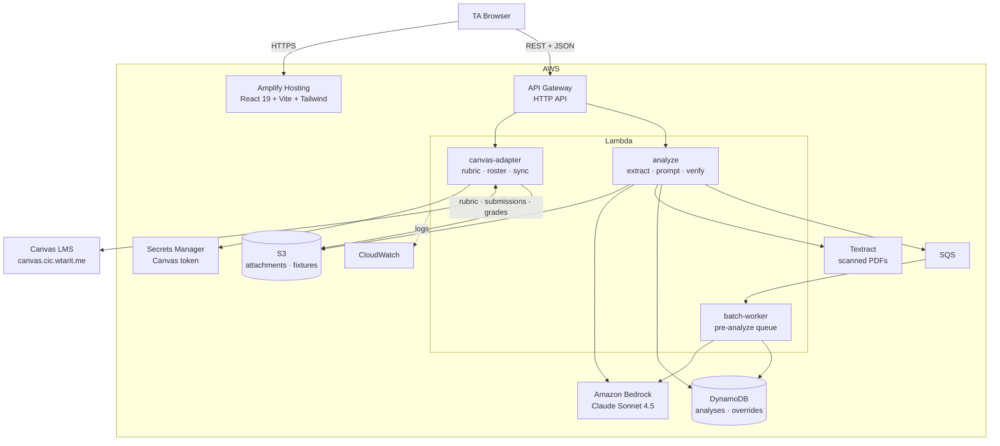
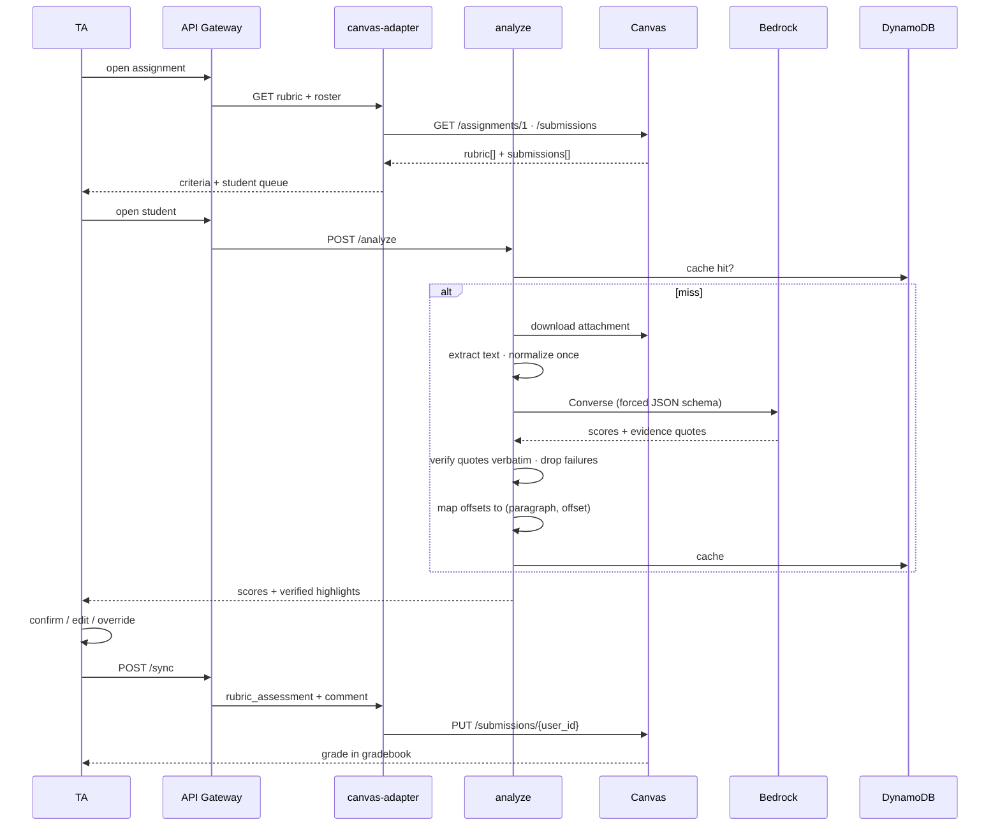

# B2TA — Architecture

Serverless on AWS. The browser talks only to our API; Canvas credentials and Bedrock
permissions stay server-side.

Region `us-east-1`.

## System diagram



## Request flow — grading one submission



## Components

| Service | Role |
|---|---|
| **Amplify Hosting** | Serves the React SPA over CloudFront. Deploy via `scripts/deploy.sh`. |
| **API Gateway** (HTTP API) | Single entry point. CORS scoped to the Amplify origin. |
| **Lambda `canvas-adapter`** | All Canvas I/O: rubric, roster, submissions, grade write-back. Handles `Link`-header pagination. |
| **Lambda `analyze`** | Text extraction → Bedrock → evidence verification → cache. The core of the product. |
| **Lambda `batch-worker`** | SQS consumer that pre-analyzes the queue so the TA never waits. |
| **Bedrock** | `us.anthropic.claude-sonnet-4-5-20250929-v1:0`, Converse API with a forced tool schema. |
| **DynamoDB** | `PK=COURSE#{c}#ASSIGN#{a}`, `SK=USER#{u}#ATTEMPT#{n}`. Keying on attempt means a resubmission re-analyzes instead of serving stale results. |
| **S3** | Downloaded attachments and offline fixtures. |
| **Secrets Manager** | Canvas API token. Never reaches the browser. |
| **Textract** | Fallback when extracted text is under 200 chars (scanned or handwritten). |

## The analyze pipeline

1. **Extract** — `online_text_entry` → strip HTML. `online_upload` → dispatch by content
   type: PDF (`pypdf`), DOCX (`python-docx`), `.ipynb` (cell sources), plain text.
2. **Normalize once** — ligatures, soft hyphens, collapsed whitespace. The normalized
   string is the single source of truth for prompting, verification, and rendering. Using
   two different strings is what makes highlights land mid-word.
3. **Prompt** — Bedrock Converse with a forced JSON schema returning, per criterion, a
   suggested rating, confidence, one-sentence rationale, and evidence quotes.
4. **Verify** — locate every quote in the submission, whitespace-insensitively. Anything
   not found is discarded and counted.

   ```python
   pattern = re.compile(r"\s+".join(map(re.escape, quote.split())))
   m = pattern.search(doc_text)   # None => hallucinated => drop
   ```

5. **Map offsets** — convert absolute positions to `(paragraphIdx, offsetInParagraph)`,
   the shape the UI renders. Offsets are always recomputed server-side; the model's own
   character counts are ignored because language models cannot count reliably.
6. **Cache** — write to DynamoDB keyed by attempt.

The model returns quotes, never offsets. That single constraint is what makes the
highlighting trustworthy.

## Canvas integration

| Purpose | Call |
|---|---|
| Assignment + rubric | `GET /api/v1/courses/{c}/assignments/{a}` |
| Submissions | `GET /api/v1/courses/{c}/assignments/{a}/submissions?include[]=user&include[]=rubric_assessment` |
| Attachment bytes | `GET` on `attachments[].url` — pre-authorized via `verifier`, no bearer token |
| Write grade | `PUT /api/v1/courses/{c}/assignments/{a}/submissions/{user_id}` |

Rubric criteria are keyed by Canvas's own string ids (`_1838`, `_7746`, …), preserved
verbatim end to end. Posting internal slugs instead returns HTTP 200 and records
nothing — a silent no-op.

Canvas paginates with RFC 5988 `Link` headers rather than a body field, so the adapter
follows `rel="next"` until absent.

## Security

- Canvas token in Secrets Manager; the frontend never calls Canvas directly.
- Submission text and student names are not logged at INFO level.
- No student work is committed to the repository.
- The TA is the only writer of grades — see the human-in-the-loop commitment in the
  [README](./README.md).

## Design decisions

| Decision | Rationale |
|---|---|
| Bedrock over a direct API key | Keeps inference inside AWS; no third-party key to distribute or leak. |
| Extract text rather than send PDFs to the model | Highlighting needs character offsets to anchor to, which a document-in/answer-out call cannot provide. |
| Verify quotes server-side | An unverified quotation is a fabricated accusation about a student's writing. |
| Cache by submission attempt | Repeat opens are instant and free; resubmissions still re-analyze. |
| Fixture mode behind the same interface | The demo runs whether or not the Canvas instance is reachable. |

Deliberately excluded: RDS/pgvector, Step Functions, Fargate, VPC networking — each adds
setup cost without changing what the product does.
