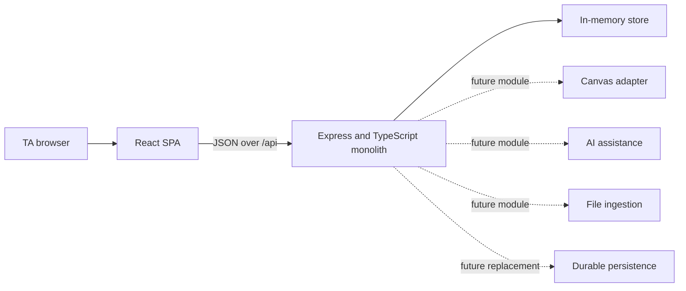
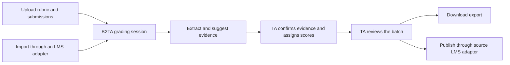

# B2TA — Architecture

B2TA is a standalone grading web application with optional LMS integrations. It owns the
grading experience; Canvas is the first external system connected to it, not the host of
the product.

## Current system

There is one backend process and one deployment unit. HTTP routes, domain logic, storage
access, file processing, AI assistance, and LMS adapters live in the same application and
may be separated into modules as they are implemented. The current code does not use
background queues or independently deployed services.

The current `MemoryStore` is intentionally temporary. It holds grading sessions, rubrics,
and empty submission collections for local frontend integration, and all state resets on
process restart. Durable persistence, uploads, grading records, analysis, Canvas submission
import, and grade publication remain future vertical slices.

The current deployment model has one trusted operator. It has no login or multi-user
authorization boundary. Authentication becomes required only if B2TA is opened to
multiple users.

## Runtime boundary

- The browser communicates only with B2TA's `/api` interface.
- LMS credentials and provider calls belong in the backend, never in the browser.
- The backend translates provider data into B2TA's canonical domain objects.
- A reviewed grade is published only after an explicit TA action.
- AWS resources are provisioned manually when needed; this repository does not define
  infrastructure templates.

## Product workflow

A grading session can begin through either manual import or an LMS adapter. Both paths
produce the same canonical rubric, submission batch, and student identity records.

Import source does not change the marking experience. A manually created session can be
exported. A session linked to an LMS can also publish results when it retains the external
course, assignment, student, criterion, and submission references required by that LMS.

## Backend modules

The backend stays monolithic while keeping clear internal ownership:

| Module | Responsibility | State |
|---|---|---|
| HTTP API | Request validation, response formatting, and frontend contract | Initial routes implemented |
| Grading core | Sessions, rubrics, submissions, evidence, scores, feedback, and review | Sessions and rubrics started |
| Persistence | Store and retrieve canonical state | In-memory implementation only |
| File ingestion | Accept files and normalize their text | Not implemented |
| AI assistance | Suggest evidence and feedback without assigning scores | Not implemented |
| LMS adapters | Import external data and publish reviewed results | Canvas PAT connection and rubric import implemented |

An internal module boundary is not a deployment boundary. New capabilities should remain
in the Express application unless operational evidence creates a concrete need to split
them later.

## Grading core

The core uses B2TA-owned concepts rather than Canvas payloads:

- a **Grading Session** contains one Rubric and one Submission Batch;
- a **Rubric** contains ordered Criteria and Performance Levels;
- a **Submission** contains normalized text and Student Identity metadata;
- a **Suggested Match** relates one Criterion to a real passage with rationale and
  confidence;
- a **Grading Record** contains TA-selected scores, confirmed evidence, and feedback;
- a **Review Confirmation** gates export or LMS publication.

Provider identifiers are external references alongside canonical entities. They are not
the primary identity of a B2TA domain object.

## LMS adapter contract

Each LMS adapter translates the same provider-neutral operations:

| Operation | Canonical result |
|---|---|
| List accessible courses and assignments | External references and display metadata |
| Import rubric | Rubric, Criteria, Performance Levels, and provider links |
| Import roster and submissions | Student Identities, Submission Batch, artifacts, and provider links |
| Refresh source state | New attempts or metadata without overwriting TA work |
| Publish reviewed results | Per-student scores and feedback from saved Grading Records |

Canvas criterion IDs, pagination links, attachment verifiers, and grade-publication
payloads belong only to the Canvas adapter.

## Safety invariants

- AI output can suggest evidence or feedback but cannot author a score.
- Suggested passages must resolve to normalized submission text before display.
- Missing evidence never prevents manual grading.
- Results leave B2TA only after TA review and an explicit export or publish action.
- Sensitive student content, access tokens, and LMS credentials do not belong in normal
  application logs.
- The single-user scope is not a safe multi-user deployment; authentication and
  per-session authorization must precede any expansion to multiple users.

## Decisions

| Decision | Rationale |
|---|---|
| Standalone product with LMS adapters | B2TA owns a consistent grading workflow while supporting Canvas first and other LMSs later. |
| One Express/TypeScript backend | A single process is the smallest architecture that supports frontend integration and rapid iteration. |
| In-memory storage for the first slice | It establishes the HTTP contract before a durable data model is chosen. |
| Canonical models plus external links | Provider payloads can evolve without leaking through the grading core. |
| TA-authored scores only | AI assistance speeds evidence review without transferring grading authority. |
| Review before export or publication | The TA has an explicit checkpoint before results leave B2TA. |

See [ADR 0001](./docs/adr/0001-standalone-product-with-lms-adapters.md) for the product
boundary decision.
